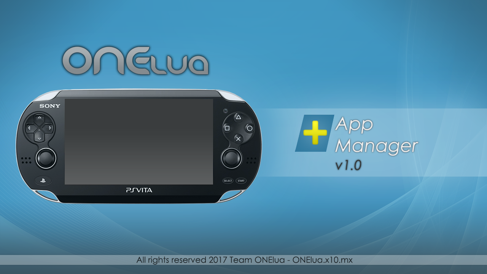

# AppManagerPlus

-

An easy to use App Manager for, as the name suggests, manage your PS Vita apps/files and your PSP games.

With AppManagerPlus from Onelua Team you can switch your PS vita apps/games from ux0: to ur0: in case you need some room to install more games, plus you can either launch or delete the apps you already have, also, it allows you to delete the apps manual.

It comes with built in File Explorer, vpk installer, custom theme installer/remover, media player, and the hability to export/set your favorite images to use as background on livearea.

As a bonus feature you can design your own theme for AppManagerPlus, with a set of various images and colors and even the font can be changed.

**#Themes for AppManager**

++	Create a new folder with the theme name and place the next resources inside: 

**font.ttf**        Font ttf for your Theme

**back.png**        Background image for Explorer (960*544)

**wave.png**        Background Image with Alpha for AppManager section (960*544)

**buttons1.png**    Image Sprites (80*20)

**buttons2.png**    Image Sprites (120*20)

**cover.png**       Image for Song Cover in Music section (369x369)

**music.png**       Image for Music section (960*544)

**ftp.png**         Background Image for FTP port message (960*544)

**list.png**        Image for ExplorerFiles and vpk/iso/cso search results found on memory card (960*544)

**menu.png**        Image for blitting the options submenu (167*443)

**themesmanager.png**		Background Image for AppManager theme selection section (960*544)

**preview.png**     Your image preview for your theme for AppManager (391*219)

**icons.png**       Sprites (112x16) must follow next order:

  1. position 0				Blitting icon for general files

  1. position 1				Blitting icon for folders

  1. position 2				Blitting icon for: pbp, prx, bin, suprx, skprx files

  1. position 3				Blitting icon for: png, gif, jpg, bmp image files

  1. position 4				Blitting icon for: mp3, s3m, wav, at3, ogg sound files

  1. position 5				Blitting icon for: vpk, rar, zip files

  1. position 6				Blitting icon for: iso, cso, dax files

**# Create a ini file**

**theme.ini**

This .ini file stores the text printing colors according to file extension

TITLE = "Name of your theme"

AUTHOR = "Name of Author"

# Main Colors
BKGCOLOR		    = 0x00000000

BARCOLOR        = 0x64FFFFFF

TITLECOLOR      = 0xFF9E9E9F

PATHCOLOR       = 0xA09E9E9F

DATETIMECOLOR   = 0xFF9E9E9F

# Explorer
SELCOLOR       	= 0x6400FF00

SFOCOLOR        = 0XFFFF07FF

BINCOLOR        = 0XFF0041C3

MUSICCOLOR      = 0xFFFFFF00

IMAGECOLOR      = 0xFF00FF00

ARCHIVECOLOR    = 0xFFFF00CC

MARKEDCOLOR     = 0x508B4513

FTPCOLOR		    = 0xA0CCCCFF

*Change only the Hex-Dec part for the desired color.

-------------------------------------------------------------------------------------------------------------

AppManager Plus Themes must be placed in the next path:

ux0:data/AppManPlus/themes/yournameTheme

**Languaje**

For new AppManager lenguage
You can translate the file ING.LUA, rename to LANG.LUA and place it in the next path:

ux0:data/AppManager/lang.lua

*Remember to translate only the quoted words from ING.LUA.

**Credits**

Xerpi for vita2d

Vitasdk

Team Molecule for Henkaku

